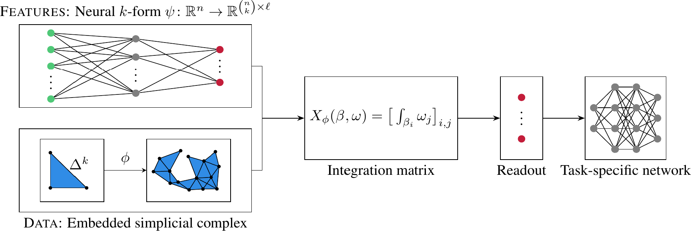

# Simplicial Representation Learning with Neural $k$-Forms 

Kelly Maggs, Celia Hacker, and Bastian Rieck

This repository contains the code for the paper *Simplicial Representation Learning with Neural k-Forms*

Geometric deep learning extends deep learning to incorporate information about the geometry and topology data, especially in complex domains like graphs. Despite the popularity of message passing in this field, it has limitations such as the need for graph rewiring, ambiguity in interpreting data, and over-smoothing. In this paper, we take a different approach, focusing on leveraging geometric information from simplicial complexes embedded in $\mathbb{R}^n$ using node coordinates. We use differential $k$-forms in $\mathbb{R}^n$ to create representations of simplices, offering interpretability and geometric consistency without message passing. This approach also enables us to apply differential geometry tools and achieve universal approximation. Our method is efficient, versatile, and applicable to various input complexes, including graphs, simplicial complexes, and cell complexes. It outperforms existing message passing neural networks in harnessing information from geometrical graphs with node features serving as coordinates.


<p align="center">
   
</p>


## Installation with `pip` or `poetry`

With `poetry install` or `pip install .`, the base packages will be set up.
However, we need to install `torch` and `torch-geometric` *manually*, since
their installation procedure differs based on CPU or GPU versions.

For the CPU versions, this should work:

```
$ pip install torch torchvision torchaudio --index-url https://download.pytorch.org/whl/cpu
$ pip install torch_geometric
$ pip install pyg_lib torch_scatter torch_sparse torch_cluster torch_spline_conv -f https://data.pyg.org/whl/torch-2.0.0+cpu.html
$ pip install torchmetrics pytorch-lightning
```

# Experiments and Tutorials

Please check out several guided tutorial notebooks in the
[`notebooks`](./notebooks/) folder. The following notebooks
are available:

- [Synthetic path classification experiments](https://github.com/aidos-lab/neural-k-forms/blob/main/notebooks/synthetic-path-classification.ipynb)
- [Synthetic surface classification](https://github.com/aidos-lab/neural-k-forms/blob/main/notebooks/synthetic-surface-classification.ipynb)
- [Visualising eigenvectors of the simplicial $1$-Laplacian operator](https://github.com/aidos-lab/neural-k-forms/blob/main/notebooks/visualising-eigenvectors.ipynb)

We have also integrated our neural $k$-forms into a simple architecture for
graph classification. To run these  experiments, reproducing **Table 1** and
**Table 2** from the main paper, run the `graphs.py` script or module
with an appropriate name:

```
$ python -m neural_k_forms.graphs --name BZR                # To run our model
$ python -m neural_k_forms.graphs --name BZR --baseline GCN # To run a baseline
```

# Architecture

TODO: Provide a brief view of the architecture and how to use it or
extend it.
